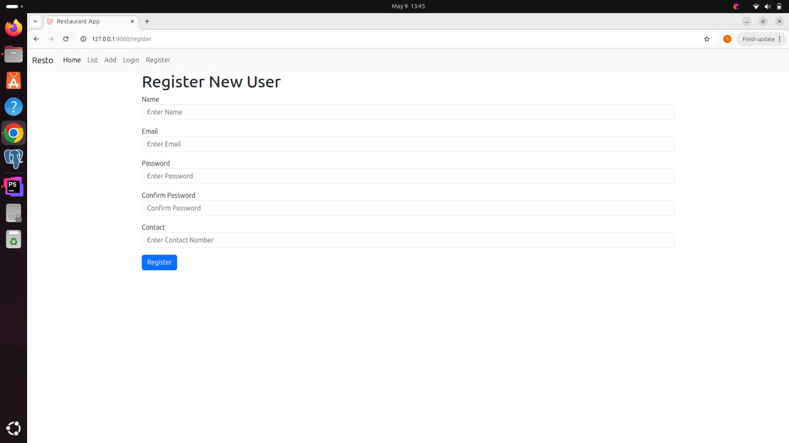
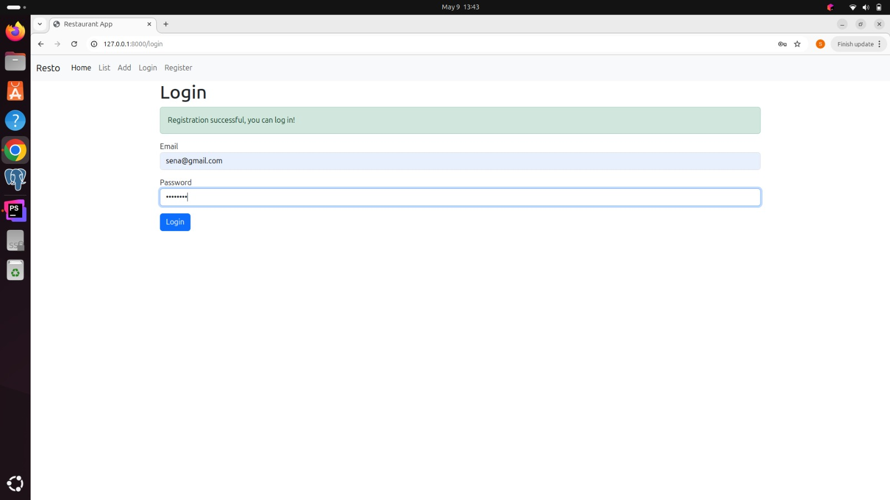
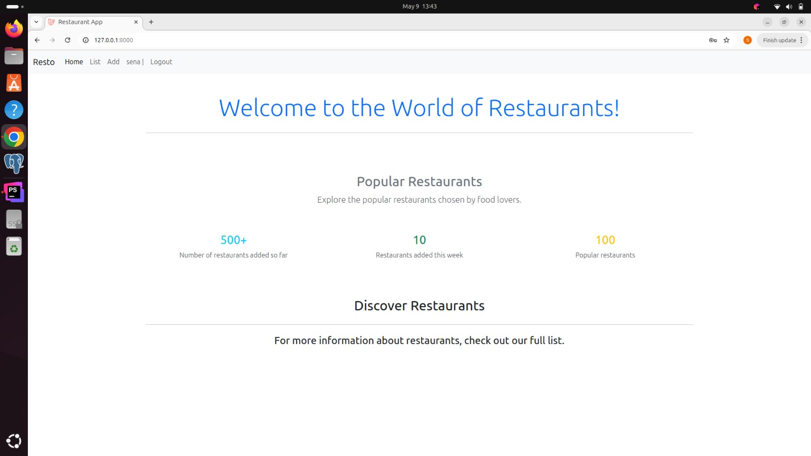
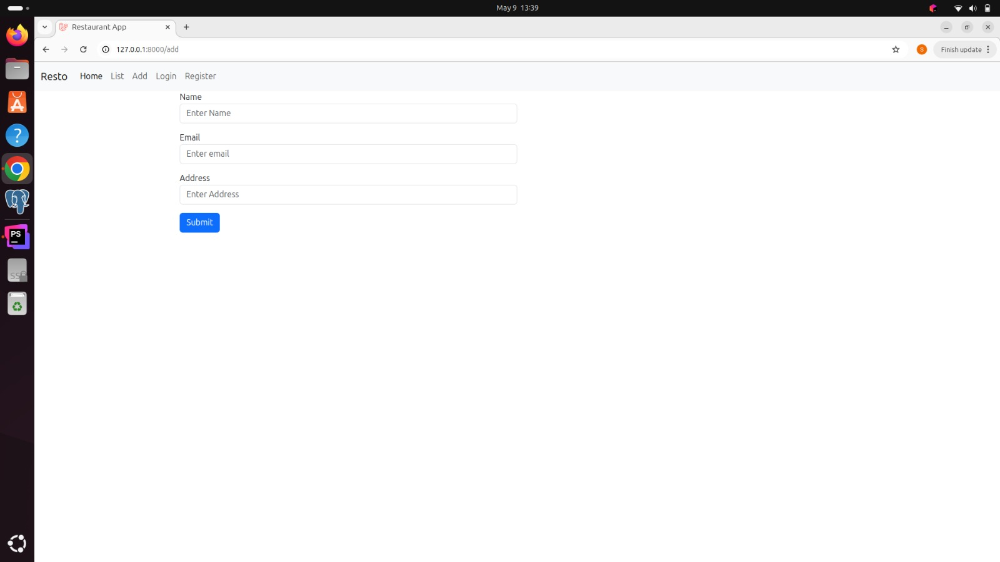
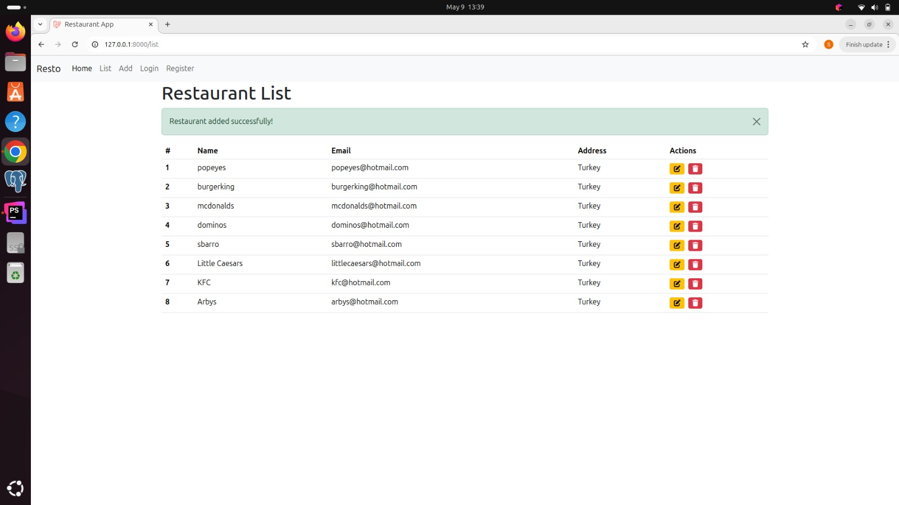

# 🍽️ Restaurant App - Laravel 

This is a **Restaurant Management Application** built with Laravel.
Users can register and log in, then add, list, update, and delete restaurants.

## 🚀 Features

- User registration and login
- Add, list, update, and delete restaurants
- Full integration with MySQL database
- Session management
- Form validation
- User-based restaurant management

---

## 🖼️ Screenshots

### ✅ Register Page

### ✅ Login Page

### ✅ Home Page

### ✅ Add Restaurant Form

### ✅ List Restaurants 

